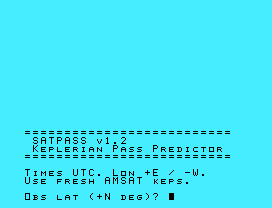
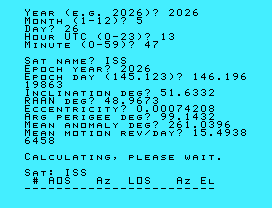

# SatPass

A simple satellite pass predictor for the **TI-99/4A** home computer, written in **TI Extended BASIC**. It computes the next several visible passes of a low-Earth-orbit (LEO) satellite — such as the ISS or an amateur-radio bird — from a fixed ground station, using classical Keplerian (two-body) orbital mechanics.

It is meant for amateur radio operators who want quick AOS/LOS and pointing information on real vintage hardware, without an internet connection or a modern computer.



-----

## Features

- Predicts up to **10 passes** over a configurable search window (default 4 days).
- Reports, for each pass:
  - **AOS** (Acquisition Of Signal) time in UTC and azimuth
  - **LOS** (Loss Of Signal) time in UTC and azimuth
  - **Maximum elevation**
- Takes standard Keplerian elements as published by [AMSAT](https://www.amsat.org/) or derived from a NORAD [TLE](https://en.wikipedia.org/wiki/Two-line_element_set).
- Output is formatted to fit within the TI-99/4A’s text screen.
- Runs on **real hardware** or on emulators such as [Classic99](https://www.harmlesslion.com/software/classic99) or js99er.net.



-----

## Requirements

- A **TI-99/4A** console with the **Extended BASIC** cartridge, **or** an emulator (Classic99, js99er) configured for Extended BASIC.
- Fresh orbital elements (Keplerians). LEO elements decay quickly, so update them every few days for best accuracy.

No peripherals are required — the program uses only the console keyboard and screen.

-----

## Getting and Running the Program

1. Load `SATPASS.xb` into Extended BASIC. On an emulator you can usually paste or “load from disk”; on real hardware, type it in or load it from your storage device.
1. Type `RUN` and press **ENTER**.
1. Answer the prompts (see below).
1. Wait for the calculation to finish, then read the pass table.

-----

## Usage

The program asks for three groups of inputs.

### Observer

|Prompt             |Meaning                                                            |
|-------------------|-------------------------------------------------------------------|
|`Obs lat (+N deg)?`|Your latitude in decimal degrees, north positive, south negative   |
|`Obs lon (+E deg)?`|Your longitude in decimal degrees, **east positive, west negative**|
|`Height ASL (m)?`  |Your height above sea level, in **meters**                         |

### Current Time (UTC)

|Prompt             |Meaning                       |
|-------------------|------------------------------|
|`Year (e.g. 2026)?`|Four-digit year               |
|`Month (1-12)?`    |Month                         |
|`Day?`             |Day of month                  |
|`Hour UTC (0-23)?` |Hour, **UTC** (not local time)|
|`Minute (0-59)?`   |Minute                        |

### Satellite Elements

|Prompt                |Meaning                                 |
|----------------------|----------------------------------------|
|`Sat name?`           |Any label, e.g. `ISS`                   |
|`Epoch year?`         |Four-digit year of the element epoch    |
|`Epoch day (145.123)?`|Day-of-year (with fraction) of the epoch|
|`Inclination deg?`    |Orbital inclination                     |
|`RAAN deg?`           |Right Ascension of the Ascending Node   |
|`Eccentricity?`       |Orbital eccentricity (e.g. `0.0006`)    |
|`Arg perigee deg?`    |Argument of perigee                     |
|`Mean anomaly deg?`   |Mean anomaly at epoch                   |
|`Mean motion rev/day?`|Revolutions per day                     |

### Mapping a TLE to the inputs

If you have a NORAD two-line element set, the fields map as follows:

```
ISS (ZARYA)
1 25544U 98067A   26145.50000000  .00016717  00000-0  10270-3 0  9993
2 25544  51.6400 210.0000 0006703  80.0000 300.0000 15.50000000 12345
```

|Program prompt|TLE source                                     |
|--------------|-----------------------------------------------|
|Epoch year    |Line 1, the `26` in `26145.5...` → enter `2026`|
|Epoch day     |Line 1, `145.50000000`                         |
|Inclination   |Line 2, field 1 (`51.6400`)                    |
|RAAN          |Line 2, field 2 (`210.0000`)                   |
|Eccentricity  |Line 2, field 3 (`0006703` → enter `0.0006703`)|
|Arg perigee   |Line 2, field 4 (`80.0000`)                    |
|Mean anomaly  |Line 2, field 5 (`300.0000`)                   |
|Mean motion   |Line 2, field 6 (`15.50000000`)                |


> **Note:** A TLE’s eccentricity has an implied leading decimal point. `0006703` means `0.0006703`.

-----

## Output

```
 # AOS   Az  LOS   Az El
------------------------
 1 12:23 306 12:33 135 68
 2 14:00 278 14:08 190  6
 ...
Done. 10 pass(es)
Accuracy ~5 min, no SGP4
Update keps often!
```

Columns, left to right: pass number, AOS time (UTC), AOS azimuth, LOS time (UTC), LOS azimuth, and maximum elevation in degrees. Azimuth is measured clockwise from true north (0° = N, 90° = E, 180° = S, 270° = W). All times are UTC.

*(The numbers above are illustrative, produced from the sample TLE; your results depend on your location, time, and elements.)*

-----

## Accuracy and Limitations

- The model is **pure two-body Keplerian**. It includes **no perturbations** — no J2 oblateness, no atmospheric drag, no SGP4/SDP4.
- Expect roughly **a few minutes** of timing error and **a few degrees** of pointing error for a typical LEO pass, *provided the elements are fresh*. Error grows quickly as elements age, because real orbits drift in ways this model ignores.
- The Earth is treated as a sphere (geocentric latitude), which adds a small additional error.
- A pass already in progress when the search window ends is not printed.
- Very brief, low-elevation passes (shorter than the coarse scan step) may be missed; see tuning below.

For serious or long-range prediction, use an SGP4-based tool. SatPass is intended as a lightweight, self-contained predictor for fun and quick planning on period hardware.

-----

## Performance

The program scans coarsely to bracket each horizon crossing, then refines the AOS/LOS edges by bisection and samples the arc for peak elevation. Trigonometric terms that don’t change during the run are computed once, and the Kepler equation solver exits early once it converges (typically in about two iterations for near-circular orbits).

On a real TI-99/4A a full run typically takes a **few minutes**; on an emulator with CPU speed unlocked it finishes in **seconds**. Highly eccentric orbits run somewhat slower because the Kepler solver needs more iterations.

-----

## Tuning

Two values near the top of the search section (around line 710) can be adjusted:

|Variable|Default|Effect                                                                                                                                |
|--------|-------|--------------------------------------------------------------------------------------------------------------------------------------|
|`CSTP`  |`0.005`|Coarse scan step in days (~7.2 min). Smaller catches shorter/lower passes but runs slower; larger is faster but may skip brief passes.|
|`MAXD`  |`4`    |Length of the search window in days.                                                                                                  |

-----

## How It Works

1. Convert the current time and the element epoch to Julian Dates.
1. Propagate the mean anomaly to the sample time and solve Kepler’s equation (Newton’s method) for the eccentric anomaly.
1. Build the satellite position in Earth-Centered Inertial coordinates from the orbital elements.
1. Compute Greenwich/Local Sidereal Time and the observer’s position vector.
1. Transform the satellite-minus-observer vector into local East/North/Up to get azimuth and elevation.
1. Step through time, detect horizon crossings, and refine each pass.

-----

## Credits

Originally written for **Paul Stoetzer, N8HM**. 73!

Contributions and bug reports are welcome.

